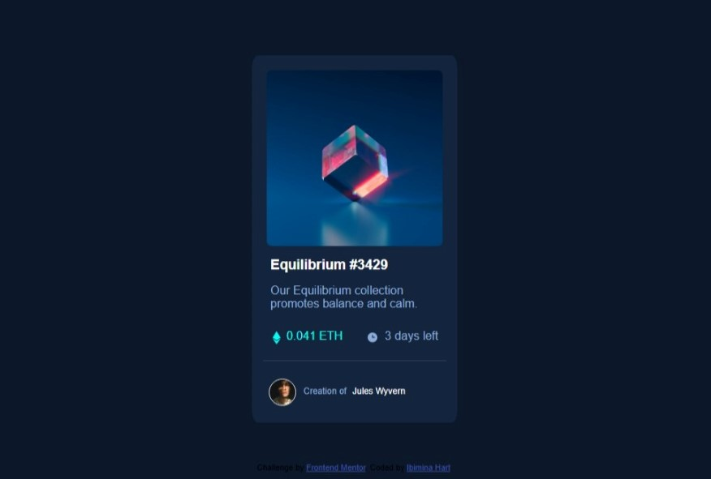

# nft-preview-card-component-main
# Frontend Mentor - NFT preview card component solution

This is a solution to the [NFT preview card component challenge on Frontend Mentor](https://www.frontendmentor.io/challenges/nft-preview-card-component-SbdUL_w0U). Frontend Mentor challenges help you improve your coding skills by building realistic projects. 

## Table of contents

- [Overview](#overview)
  - [The challenge](#the-challenge)
  - [Screenshot](#screenshot)
  - [Links](#links)
- [My process](#my-process)
  - [Built with](#built-with)
  - [What I learned](#what-i-learned)
  - [Continued development](#continued-development)
- [Author](#author)


## Overview

### The challenge

Users should be able to:

- View the optimal layout depending on their device's screen size
- See hover states for interactive elements

### Screenshot




### Links

- Solution URL: [Add solution URL here](https://your-solution-url.com)
- Live Site URL: [Add live site URL here](https://your-live-site-url.com)

## My process

### Built with

- Semantic HTML5 markup
- CSS custom properties
- Flexbox
- Mobile-first workflow


### What I learned

learnt ho to use place a invisible card over an image wrapper in an anchor tag positioned relative and adding before and after pseudo elements positioned absolute with 0 opacity

```css
.imgcontainer a::before {
    content: '';
    background-image: url(images/icon-view.svg);
    width: 46px;
    height: 46px;
    opacity: 0;
    position: absolute;
    left: 42%;
    margin: 0 auto;
    top: 39%;
}

.imgcontainer a::after {
    content: '';
    background-color: hsl(178, 100%, 50%);
    opacity: 0;
    position: absolute;
    top: 0;
    left: 0;
    width: 100%;
    height: 100%;
    border-radius: 3%;
}
```


## Author

Ibimina Hart
- Frontend Mentor -(https://www.frontendmentor.io/profile/ibimina)


